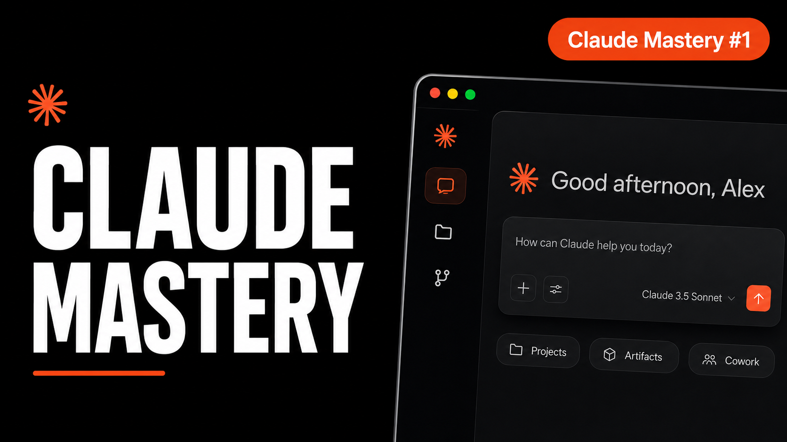

# Claude Mastery: Real Projects, Real Results

A hands-on YouTube series teaching every major Claude Desktop feature through 5 real project builds — no fluff, no toy examples.

## Videos

| # | Project | Claude Features | Watch |
|---|---------|----------------|-------|
| 1 | SaaS Landing Page | Projects, Artifacts, Customize, Cowork | [Watch →](https://youtu.be/pZ3NyxIWtj0?si=isfB2g0uq0rVJExO) |
| 2 | Mobile App | Projects, Artifacts, Extended Thinking | [Watch →](https://www.youtube.com/playlist?list=PL1rTWcryo2aioxBbN6nxjhITkHAKayk_t) |
| 3 | Python Backend / Desktop App | Projects, Artifacts, Git & Cloud Dev | [Watch →](https://www.youtube.com/playlist?list=PL1rTWcryo2aioxBbN6nxjhITkHAKayk_t) |
| 4 | Data Analysis Dashboard | Projects, Artifacts, Cowork | [Watch →](https://www.youtube.com/playlist?list=PL1rTWcryo2aioxBbN6nxjhITkHAKayk_t) |
| 5 | Automation Workflow | Projects, Routines, Dispatch | [Watch →](https://www.youtube.com/playlist?list=PL1rTWcryo2aioxBbN6nxjhITkHAKayk_t) |

[Full Playlist](https://www.youtube.com/playlist?list=PL1rTWcryo2aioxBbN6nxjhITkHAKayk_t)

## Repo Structure

Each video has its own branch with all source files, prompts, and assets used during recording.

```
main
├── video-1-saas-landing-page
├── video-2-mobile-app
├── video-3-python-backend
├── video-4-data-dashboard
└── video-5-automation-workflow
```

## 🔧 Tools Used

- [Claude Desktop](https://claude.ai/download)
- Claude Projects, Artifacts, Extended Thinking
- Cowork, Customize, Routines, Dispatch
- Git / GitHub (cloud dev integration)
